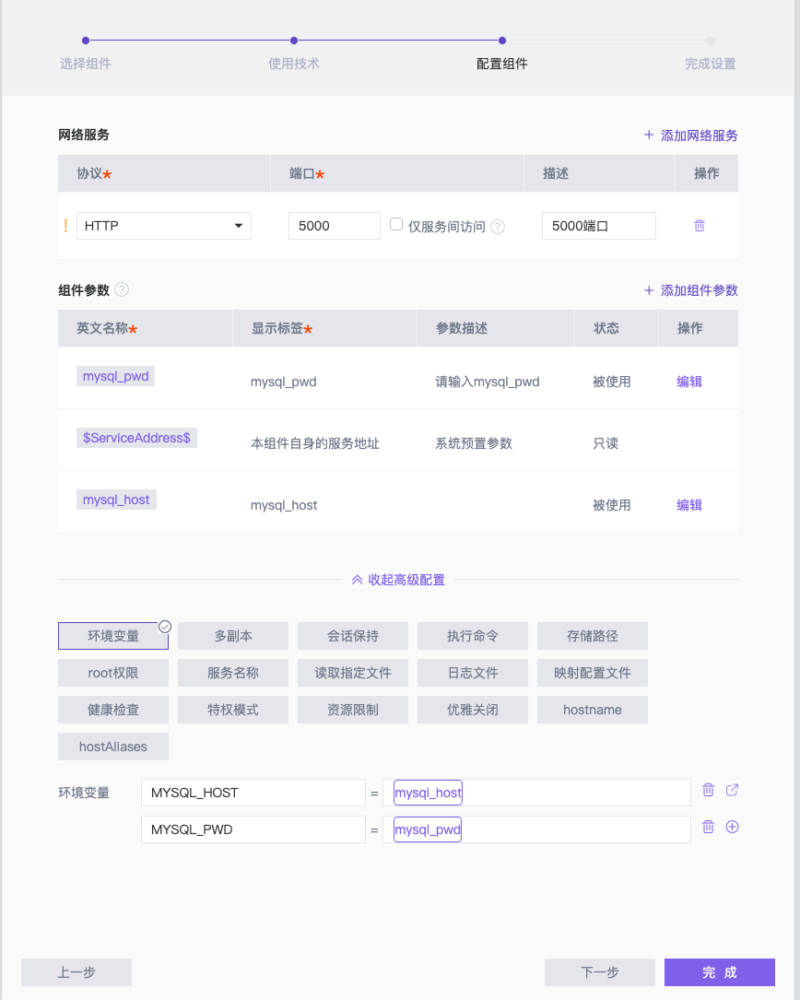

# StarOS 演示项目 - API

该仓库为 [StarOS](http://staros.cloud) 的演示项目 **Wall** 中的后端组件。

**Wall** 项目的其余组件为：
- 前端组件：[example-wall-web](https://github.com/StarOS-Cloud/example-wall-web)
- 数据库组件：[example-wall-db](https://github.com/StarOS-Cloud/example-wall-db)

## 简介
该组件主要使用 Flask/Python3 进行开发，主要提供如下接口：

- \[GET\] `api/comment`  查看全部评论。
- \[POST\] `api/comment`  增加一条新评论。
  ``` json
  // request body
  {
    "title": "标题"
  }
  ```

## 在 StarOS 中使用

### 技术栈
该组件使用 Python3+ 的技术栈即可，无需单独编写 Dockerfile。

### 组件配置
在 StarOS 中，该组件的配置方式如下：
1. 声明端口，Flask 默认使用 `5000` 端口，协议类型为 `HTTP`；
2. 利用连线，将[数据库组件](https://github.com/StarOS-Cloud/example-wall-db)的访问地址连接至环境变量 `MYSQL_HOST`；
3. 声明组件参数，并关联至环境变量 `MYSQL_PWD`，用于给该环境变量赋值；
4. 在架构图中选择该组件，引用[数据库组件](https://github.com/StarOS-Cloud/example-wall-db)的密码参数，留待发布时填充。

可参考下图进行配置：


## 开发

您可以通过对该仓库进行 Fork 来二次开发。

如果您熟悉 Python 与 Flask，可尝试修改 `./api/comment.py` 来改变该组件提供的 API。

如需调试代码，需确保编码环境已经安装了 Python3，并执行如下代码拉取依赖：

``` shell
pip install -r requirements.txt
```

如需运行该服务，执行：

``` shell
python main.py
```

或

``` shell
export FLASK_APP=main.py; flask run
```

## 部署

### 构建

在命令行中键入如下命令，即可在本地构建镜像（需要先安装 Docker）：

``` shell
# 克隆代码
git clone https://github.com/StarOS-Cloud/example-wall-backend.git
# 构建命令
docker build -t wall/api:latest ./example-wall-backend
```

### 运行
在命令行中运行如下命令，即可运行：

``` shell
docker run -d -p 5000:5000 \
    --name wall-api \
    -e MYSQL_HOST=<MYSQL_HOST> \
    -e MYSQL_PWD=<MYSQL_PWD> \
    wall/api
```

其中：
- `<MYSQL_HOST>` 为[数据库组件](https://github.com/StarOS-Cloud/example-wall-db)的访问地址
- `<MYSQL_PWD>` 为[数据库组件](https://github.com/StarOS-Cloud/example-wall-db)的 `root` 用户密码
建议先部署[数据库组件](https://github.com/StarOS-Cloud/example-wall-db)后，再运行该组件。

## 关于
[StarOS](http://staros.cloud) 是一款一站式云原生在线开发平台，致力于探索云原生应用的研发模式最佳实践。

如果您对我们感兴趣，或有任何问题或建议，欢迎随时联系我们：


邮箱：[hi@staros.cloud](mailto://hi@staros.cloud)
